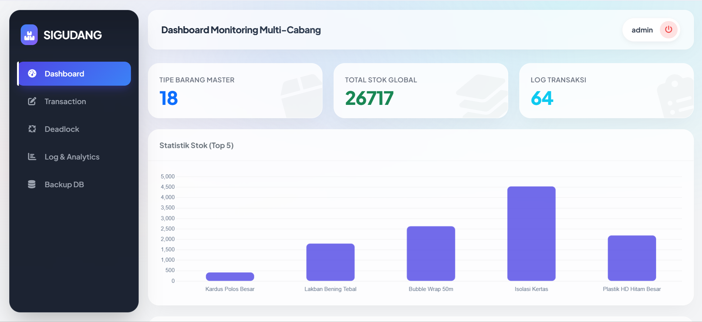

# 📦 Si-Gudang (Proyek UAP)
Proyek ini merupakan sistem inventaris dan manajemen gudang sederhana yang dibangun menggunakan PHP dan MySQL. Tujuannya sebagai platform pencatatan transaksi masuk, keluar, dan mutasi barang antar cabang dengan memanfaatkan Database Views, SQL Joins & Set Operations, Deadlock Management,procedure,  function, trigger, dan backup database + task scheduler. Sistem ini dilengkapi dengan interface yang bersih untuk memudahkan pemantauan stok secara langsung.

<h1>📌 Detail Konsep</h1>



## ⚙️ Trigger
Trigger ini bertujuan untuk menjaga konsistensi jumlah stok di tabel `stok_cabang` secara real-time setiap kali ada rekaman baru yang masuk di tabel `transaksi`.
`update_stok_otomatis` : 
- Jika transaksi **masuk**, maka stok di cabang tujuan akan bertambah.
- Jika transaksi **keluar**, maka stok di cabang asal akan berkurang.
- Jika transaksi **mutasi**, stok di cabang asal berkurang, dan stok di cabang tujuan bertambah.

```sql
DELIMITER $$
CREATE TRIGGER `update_stok_otomatis` AFTER INSERT ON `transaksi` FOR EACH ROW 
BEGIN
    IF NEW.jenis_transaksi = 'masuk' THEN
        INSERT INTO stok_cabang (barang_id, cabang_id, stok) 
        VALUES (NEW.barang_id, NEW.cabang_tujuan_id, NEW.jumlah)
        ON DUPLICATE KEY UPDATE stok = stok + NEW.jumlah;
    ELSEIF NEW.jenis_transaksi = 'keluar' THEN
        UPDATE stok_cabang SET stok = stok - NEW.jumlah 
        WHERE barang_id = NEW.barang_id AND cabang_id = NEW.cabang_asal_id;
    ELSEIF NEW.jenis_transaksi = 'mutasi' THEN
        UPDATE stok_cabang SET stok = stok - NEW.jumlah 
        WHERE barang_id = NEW.barang_id AND cabang_id = NEW.cabang_asal_id;
        
        INSERT INTO stok_cabang (barang_id, cabang_id, stok) 
        VALUES (NEW.barang_id, NEW.cabang_tujuan_id, NEW.jumlah)
        ON DUPLICATE KEY UPDATE stok = stok + NEW.jumlah;
    END IF;
END$$
DELIMITER ;
```

## 🧩 Fragmentasi Data (Menggunakan View)
Untuk mempermudah pengelolaan dan analisis data yang besar, sistem ini menggunakan simulasi fragmentasi data menggunakan **View**. Terdapat tiga jenis fragmentasi yang diterapkan pada data transaksi:

1. **Fragmentasi Horizontal**: Memisahkan baris data berdasarkan kriteria tertentu (Contoh: Hanya transaksi barang masuk).
```sql
CREATE VIEW `v_frag_transaksi_masuk` AS
SELECT * FROM transaksi WHERE jenis_transaksi = 'masuk';
```

2. **Fragmentasi Vertikal**: Memisahkan kolom data yang spesifik untuk ringkasan (Contoh: Menampilkan informasi kuantitas transaksi saja).
```sql
CREATE VIEW `v_frag_transaksi_detail` AS
SELECT id, barang_id, jumlah FROM transaksi;
```

3. **Fragmentasi Campuran**: Kombinasi filter baris dan filter kolom sekaligus (Contoh: Rekap khusus untuk kuantitas transaksi masuk).
```sql
CREATE VIEW `v_frag_transaksi_masuk_ringkas` AS
SELECT id, barang_id, jumlah, tanggal 
FROM transaksi 
WHERE jenis_transaksi = 'masuk';
```


## 💾 Backup Otomatis & Task Scheduler

Sistem ini dilengkapi backup otomatis menggunakan `mysqldump` yang dijalankan melalui Windows Task Scheduler setiap 3 menit. File backup otomatis dihapus setelah 30 hari.

### 🔧 Setup Awal - Variable yang Harus Diubah

Sebelum menjalankan setup, pastikan variable di file berikut sudah sesuai:

#### 1. **auto_backup.php**
```php
$mysqldumpPath = "C:\\laragon\\bin\\mysql\\mysql-8.0.30-winx64\\bin\\mysqldump.exe";  // ← Path mysqldump
$host = "localhost";
$user = "root";           // ← User MySQL
$pass = "";               // ← Password MySQL
$db = "db_gudang";        // ← Nama database
```

#### 2. **setup_scheduler.ps1**
```powershell
[string]$projectPath = "C:\laragon\www\UTP_PDT_sigudang"    # ← Path project Anda
[string]$phpPath = "C:\laragon\bin\php\php-8.1.10-Win32-vs16-x64\php.exe"  # ← Path PHP CLI
[int]$intervalMinutes = 3  # ← Interval backup (dalam menit)
```

### ▶️ Cara Setup Task Scheduler

1. **Buka PowerShell sebagai Administrator**
2. **Jalankan script setup:**
   ```powershell
   powershell -ExecutionPolicy Bypass -File "C:\laragon\www\UTP_PDT_sigudang\setup_scheduler.ps1"
   ```
3. **Konfigurasi selesai!** Task akan berjalan otomatis setiap 3 menit

### 📋 File Penting
- **auto_backup.php** - Script backup CLI (dijalankan Task Scheduler)
- **backup_status.json** - Status auto backup (enable/disable)
- **backup/** - Folder penyimpanan file backup
- **setup_scheduler.ps1** - Setup Task Scheduler Windows

### ⚙️ Mengontrol Auto Backup
- **Start:** Buka halaman backup → Klik "Mulai Backup Otomatis"
- **Stop:** Buka halaman backup → Klik "Stop Backup Otomatis"
- **Manual Backup:** Klik tombol "Buat Backup Sekarang"